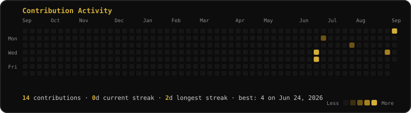

 

 

### <code>The Cipher Stack</code>

<table>
<tr>
<td width="40%" valign="top">

</td>
<td width="60%" valign="top">

</td>
</tr>
</table>

 

### <code>Contributions</code>

Heatmap refreshes automatically every day at 06:17 UTC via GitHub Actions.

 

### <code>Featured Gallery</code>

<table width="100%">
<tr>
<td width="50%" valign="top">

<h4>CampusFind — Team Project</h4>

<code>HTML</code> <code>CSS</code> <code>Vanilla JS</code> <code>Node.js/Express</code> <code>PostgreSQL</code>

Full-stack lost-and-found platform built for the University of Regina, digitizing a process previously handled manually by Protective Services. Designed the PostgreSQL schema and query layer powering item postings, searches, and claim matching; collaborated through the full lifecycle from requirements to deployment.

</td>
<td width="50%" valign="top">

<h4>Beyond Recipe — Personal Project</h4>

<code>HTML</code> <code>CSS</code> <code>JavaScript</code> <code>PHP</code> <code>MySQL</code> <code>AJAX</code> <code>JSON</code>

Full-stack recipe-sharing app where users post, browse, and comment on recipes. Built MySQL queries for data retrieval, real-time content updates via AJAX, and applied secure coding practices including input validation and SQL-injection protection.

</td>
</tr>
<tr>
<td width="50%" valign="top">

<h4>Personal Portfolio Website</h4>

<code>HTML</code> <code>CSS</code> <code>JavaScript</code> <code>PHP</code>

Self-directed portfolio site covering the full lifecycle from design to deployment, featuring a dynamic PHP-powered contact form for collaboration inquiries.

</td>
<td width="50%" valign="top">

</td>
</tr>
</table>

 

### <code>Tech Arsenal</code>

**Frontend**
 

**Backend &amp; Database**
 

**Tools &amp; DevOps**
 

  

 

### <code>What I'm Up To</code>

- 🧠 Strengthening my foundations in computer science
- 🛠️ Building small projects that solve real problems
- 🌐 Improving my web development skills

 

### <code>Achievements</code>

<table>
<tr>
<td>🏅</td>
<td>
<b>Google IT Support Professional Certificate</b> — Google / Coursera
 
Completed a multi-course program covering troubleshooting, customer support, networking, operating systems, system administration, and security for entry-level IT support roles.
</td>
</tr>
<tr>
<td>🏅</td>
<td>
<b>CISCO Cybersecurity Certificate</b>
 
Cybersecurity fundamentals certification from Cisco's Networking Academy.
</td>
</tr>
</table>

 

### <code>Socials</code>

  

 
Scan to visit the live portfolio

 

